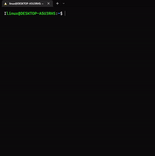

# Weather CLI
A command Line weather forcast app, created in Node.js. Developed from the scratch (no external library is used).


## Features

- Plug and Play (No initial co-ordinate or api-key is needed).
- Provide current weather( within an hour), alongside up to seven days of prediction.
- Lightweight and economical in size due to not useing any external library.
- Begainer friendly help page.

## Installation
First clone the repo
```bash
git clone https://github.com/marufHasanQ/cloudSky.git
cd cloudSky

```
then globaly install project with npm

```bash
npm install --global

```


## Usage
To get current weather and forcast of next seven days

```bash
weather
```


#### To get available options

```bash
weather --help
```



## CLI options
### --fields,  -f
#### Adds parameter fields to the prediction data
Example:
```bash
weather -f apparent_temperature_min 
```
available values for the options
| Parameter | Description                |
| :--------  | :------------------------- |
|   rain_sum    | Sum of daily rain.    |
|   precipation_sum     |  Sum of daily precipitation (including rain, showers and snowfall)|
|   snowfall_sum     |  Sum of daily snowfall  |

....and more.

### --past_days,  -pd
####   Sets the starting day for the prediction. 
Example:
```bash
weather -pd 1
```
available values for the options
| Parameter   | Description                |
| :--------  | :------------------------- |
|   1     |   Start the prediction one day before the currnet date |
|   2     |  Start the prediction two days before the currnet date |

....and more.

### --temperature_unit,  -tu
####   changes the unit of the fields related to temperature. 
Example:
```bash
weather -tu celsius
```
available values for the options
| Parameter   | Description                |
| :--------  | :------------------------- |
|   celsius     |   Sets temperature unit to celsius|
|   fahrenheit     | Sets temperature unit to fahrenheit |

....and more.
### --windspeed_unit,  -wu
####  Changes the units which are related to windspeed.
Example:
```bash
weather -wu kmh 
```
available values for the options
| Parameter  | Description                |
| :--------  | :------------------------- |
|   kmh    |   Sets the windspeed unit to kmh, this is difault  |
|   mph    | Sets the windspeed unit to mph  |
|   ms     |   Sets the windspeed unit to ms  |
|   kn     | Sets the windspeed unit to kn |

....and more.
## License

[MIT](https://choosealicense.com/licenses/mit/)
